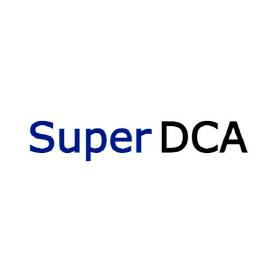

# Security Report for the Super DCA Liquidity Contest

https://audits.sherlock.xyz/contests/1171

### [H-1] Broken logic in SuperDCA Listing Fee Collection

**Description:** 

The `collectFees()` function in the `SuperDCAListing.sol` contract is designed to collect accumulated fees from `Uniswap v4` liquidity positions. However, the function fails to correctly handle pools that include native `ETH`. The current implementation exclusively uses the `IERC20` interface to check token balances, which is incompatible with native `ETH`. This flaw leads to a denial of service for fee collection from any `ETH`-paired pool, resulting in a permanent loss of all `ETH`-denominated fee revenue.

**Root Cause:**

The core of the vulnerability lies in the direct casting of currency addresses to the `IERC20` interface within the `collectFees()` function. `Uniswap v4` introduces direct support for native `ETH` in its liquidity pools. When a pool includes native `ETH`, the protocol represents it with the zero address (`address(0)`).

The `collectFees()` function does not account for this distinction. It attempts to call `balanceOf()` on the currency address with an assumption that it is always a valid `ERC20` token contract. When the currency is native `ETH`, this results in a call to `IERC20(address(0)).balanceOf()`, which will either revert the transaction or fail to report the correct balance of `ETH` received.

https://github.com/sherlock-audit/2025-09-super-dca/blob/main/super-dca-gauge/src/SuperDCAListing.sol#L292-L332

**Impact:**

- Permanent Loss of Funds: All fees denominated in native `ETH` that are generated by listed positions are uncollectible. Since `ETH`-paired pools are among the most popular and generate significant volume, this could represent a substantial loss of revenue for the protocol.
- Denial of Service (DoS): The `collectFees()` function is rendered completely unusable for any pool pair involving native `ETH`. This means that even the fees for the paired `ERC20` token (e.g., `USDC` in a `USDC/ETH` pool) cannot be collected because the entire transaction reverts.

### [H-2] Unstake Function Leads to Permanent Reward Loss

**Description:**

A critical race condition vulnerability exists in the `unstake()` function of the `SuperDCAStaking.sol` contract. When a user unstakes their tokens, the function prematurely resets a crucial reward accounting checkpoint (`lastRewardIndex`). This action permanently erases any pending rewards that have accrued for the
entire token bucket since the last global reward calculation, leading to a direct and irrecoverable loss of funds for all stakers in that pool.

**Root Cause:**

The core of the vulnerability lies in the incorrect state change within the `unstake()` function. The function's logic assumes that rewards have been fully accounted for up to the moment of unstaking, which is not guaranteed.
Specifically, this line is the culprit:
`info.lastRewardIndex = rewardIndex;`
This action updates the token bucket's reward checkpoint to the current global `rewardIndex` without first ensuring that the rewards accumulated in the `delta (rewardIndex - old_lastRewardIndex)` have been calculated and distributed by the `SuperDCAGauge.sol` contract. The function fails to separate the act of withdrawing principal from the process of accounting for earned rewards.

https://github.com/sherlock-audit/2025-09-super-dca/blob/main/super-dca-gauge/src/SuperDCAStaking.sol#L237-L264

**Impact:**

Permanent loss of pending rewards for all affected users.

### [M-1] First Staker Receives Unearned Inflationary Reward

**Description:**

A critical flaw in the initialization logic of the `SuperDCAStaking.sol` contract allows the first user to stake to claim an enormous, unearned reward. The contract incorrectly calculates rewards for the entire "dead time" period between its deployment and the first stake, attributing this entire amount to the first staker.

**Root Cause:**

1. Initialization: In the constructor, `lastMinted` is set to `block.timestamp`. Let's call this `T0`
2. First Stake: A long time later (e.g. 30 days), the very first user; Alice, calls `stake()`
    - The stake function immediately calls `_updateRewardIndex()`
    - Inside `_updateRewardIndex()`, the first line is a check: `if (totalStakedAmount == 0) return`
    - Because Alice is the first staker, `totalStakedAmount` is 0, so the function returns immediately
    - Crucially, `lastMinted` is NOT updated. It remains `T0`
    - Alice's stake is then added, and `totalStakedAmount` becomes non-zero
3. First Reward Calculation: A short time later (e.g., 1 hour), the `SuperDCAGauge` calls `accrueReward()` for Alice's token bucket
    - `accrueReward()` calls `_updateRewardIndex()`
    - This time, `totalStakedAmount` is not zero, so the check passes
    - The function calculates `elapsed = block.timestamp - lastMinted`. This becomes `(T0 + 30 days + 1 hour) - T0`, which equals 30 days and 1 hour
    - It then calculates a `mintAmount` based on this enormous elapsed time
    - This massive `mintAmount` is used to increase the `rewardIndex`, which is then used to calculate the reward for Alice's bucket

The result is that the rewards for the entire 30-day "dead time" period—when nobody was staking—are calculated and attributed entirely to Alice, who has only been staking for one hour.

https://github.com/sherlock-audit/2025-09-super-dca/blob/main/super-dca-gauge/src/SuperDCAStaking.sol#L183

**Impact:**

It allows for a massive, unjust transfer of value to a single user at the expense of the entire protocol and its community. The first staker is disproportionately rewarded in a way that is completely unrelated to their actual contribution.

### [L-1] Flash Loan Attack Possible When Listing

**Description:**

A high-severity vulnerability exists in the `list()` function of the `SuperDCAListing.sol` contract. The function relies on a manipulatable, real-time `Uniswap V4` spot price to calculate the value of a user's NFT liquidity position. An attacker can leverage a flash loan to temporarily skew the pool's price, causing the contract to overvalue their position and accept it for listing, even if it fails to meet the protocol's minimum liquidity requirements under normal market conditions.

**Root Cause:**

The root cause of the vulnerability is the use of an unsafe price oracle. The contract directly queries the current `sqrtPriceX96` from the Uniswap pool's `slot0` to determine the value of assets in a liquidity position.

The specific flawed logic is in the _getAmountsForKey internal function, which is called by list:
`(uint160 sqrtPriceX96,,,) = POOL_MANAGER.getSlot0(key.toId());`

This line fetches the instantaneous spot price, which is not resistant to manipulation. This flawed price data is then used in the `LiquidityAmounts.getAmountsForLiquidity` calculation, and the result is trusted for the critical security check: `if (dcaAmount < minLiquidity)`.

https://github.com/sherlock-audit/2025-09-super-dca/blob/main/super-dca-gauge/src/SuperDCAListing.sol#L197-L259

**Impact:**

The primary impact is the complete bypass of the `minLiquidity` requirement, which is a core safety mechanism of the protocol.